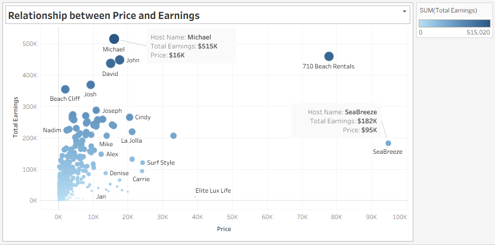
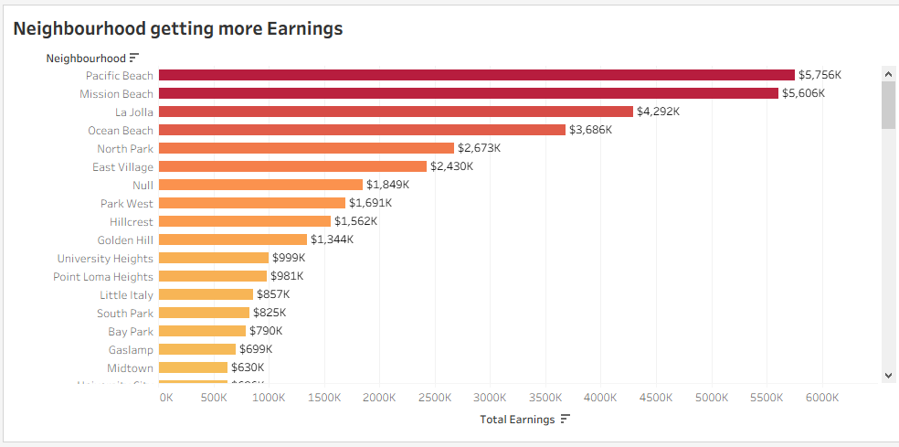
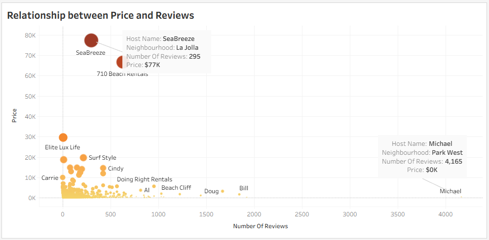

# 📊 StayCatin.com Property Analysis Dashboard

[View Dashboard on Tableau Public 🔗](https://public.tableau.com/app/profile/kartik.sarwan/viz/StayCatinDataSet/StayCatinAnalysisDashboard?publish=yes)

## 🧠 Project: StayCatin.com Listings

### 📌 Problem Statement

You’ve joined **StayCatin.com**, an online vacation rental platform similar to Airbnb, as a Business Analyst. Management needs data-driven insights to improve decision-making based on the property listings, customer reviews, and pricing data over time.

Your task: Build an interactive **Tableau dashboard** that helps answer key business questions using the available dataset.

---

## 🎯 Business Questions to Solve

1. 🏆 Which are the **Top 10 revenue-generating properties**?
2. 💸 Is there a **relationship between price and earnings**?
3. 🗺️ Are any **locations (shores)** generating significantly **higher earnings**?
4. ⭐ How does **price correlate with customer reviews**?

---

## 📈 Dashboard Preview

> 📍 *Below are snapshots from the interactive Tableau dashboard.*

### 🔟 Top 10 Earners


### 💵 Price vs Revenue


### 🏝️ Location-wise Earnings (Shore Analysis)


### 💬 Price vs Reviews


---

## 📌 Storyboard & Insights

| 🔍 Insight Area | 📊 Summary |
|----------------|-----------|
| **Top 10 Earners** | These properties contributed disproportionately to overall revenue. Helpful for understanding best performers. |
| **Price vs Revenue** | A clear upward trend indicates that higher-priced properties tend to generate more revenue — but not always proportionally. |
| **Location-Based Earnings** | Certain shores (e.g., Beachfront or Lakeview) consistently outperform others. Suggests location is a strong driver. |
| **Price vs Reviews** | Mixed results — some high-priced properties had low reviews. Indicates a need to improve customer experience. |

---

## 🛠️ Tools Used

- **Tableau**: For creating interactive dashboards and visual analytics
- **Excel / CSV**: Data preprocessing

---

## 📂 Project Structure

```plaintext
StayCatin-Analysis/
│
├── data/
│   └── staycatin_dataset.csv
│
├── dashboard/
│   ├── StayCatinAnalysisDashboard.twbx
│   └── images/
│       ├── top10_earners.png
│       ├── price_vs_revenue.png
│       ├── location_earnings.png
│       └── price_vs_reviews.png
│
├── README.md
